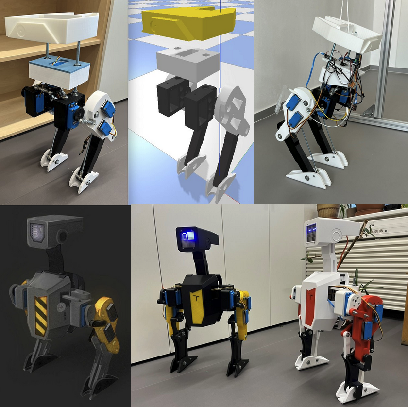
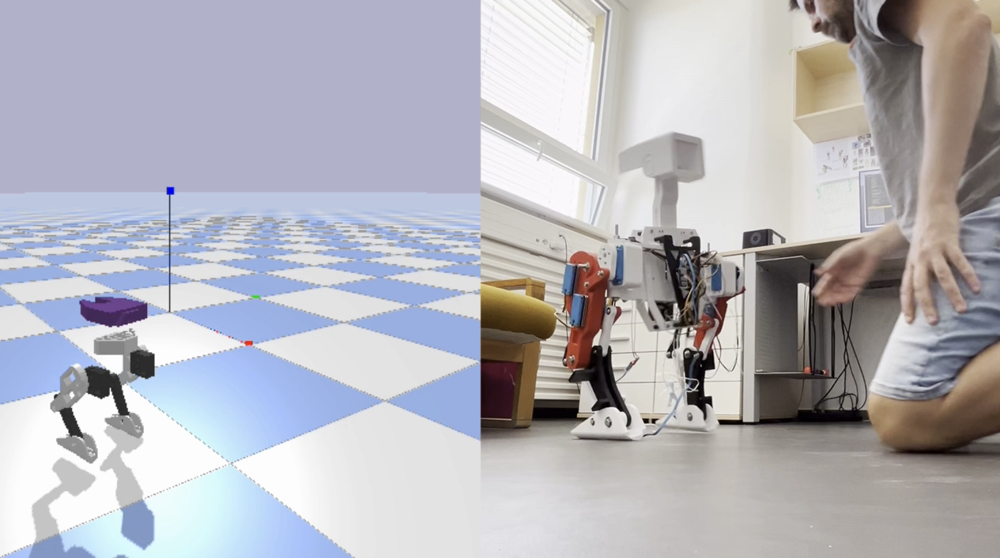

# Steam Duck - PAWO (Personal Autonomous Walking Optimizer)

I started the project at the end of November 2023 as my own version of the BDX Droid [1] from Disney Imagineering. The original code name was **Steam Duck**, but for stylistic reasons I later renamed it after the mythical peacock (the star constellation *Pavo*). After that, I came up with an acronym, so the name became **P.A.W.O. (Personal Autonomous Walking Optimizer)**.

Finally, during an exhibition in Brno in October 2025, some students jokingly called the robot a **“futuristic chicken.”**

So yes — this project has had many names and versions. But no matter what the name is, it remains a very cool experiment in figuring out how to build a beautiful machine like the BDX Droid using only off-the-shelf components. The idea is to make it possible for anyone to build it with just 3D-printed parts, a screwdriver, and standard hobby-shop materials.

📺 [YouTube Channel](https://youtube.com/playlist?list=PLCrnO1B0KE3rKf2_9nu4y9VyF9zSY7Yt8&si=5LN6mWCUGIe7l07J) – See our robots in action!

☕ [Buy me a Coffee](https://www.vut.cz/en/people/stanislav-vechet-18462) at Laboratory of bio-inspired robotics, Institute of Autonomous Systems

# Steam Duck v1

First version of the droid with simple linkages, simple joints with hope everything will magicaly work...which wasn't.

The main idea was to control the robot using PPO (Proximal Policy Optimization) which was also very naive to work in first place, even it does something.

# Steam Duck v2 - PAWO

The hardware for version 2 was completely redesigned, and we were able to create a simulation model in PyBullet that was accurate enough to experiment with several cyclic gait algorithms. This model is based on the version-1 geometry, but uses the updated dynamic parameters from version 2. The model still has 3 DOF per leg.
At this stage, we combined classic control algorithms—specifically a custom Raibert-style controller based on classical dynamics calculations—with reinforcement learning. The RL component used PPO from Stable Baselines3 along with a custom MPC module. Even though I wasn’t completely satisfied with the results, it somehow works. :)

# SteamDuck v3 - Futuristic Chicken

🚧 Current Status (Nov. 2025)

The robot is currently under heavy development.

Like… __really__ heavy.

We’re working on:

 * Updating the walking strategy 🚶‍♂️🧠

 * Refining the simulation model 🤖💻

 * Total hardware overhaul (yes, again 🙃)

   * Adding two more joints per leg → 5 DOF each 🔧

   * Adding sensors on every joint 📡

Hoping that this third big redesign will finally be the one where the robot gracefully strolls not only around our lab, but also casually down the hallways like it owns the place 😎✨

| **Parameter**               | **BDX** [1]         | **PAWO v2**            | **#?#?# v3** |
| --------------------------- | ------------------- | ---------------------- | ------------ |
| Step duration               | 0.5 s               | 0.6 s                  |              |
| Swing phase                 | 0.2 s               | 0.2 s                  |              |
| Step height                 | 0.05 m              | 0.03 m                 |              |
| Hip flexion-extension drive | 34 Nm, 20 rad/s     | 5 Nm, 6.4 rad/s, 7.4 V |              |
| Robot total mass            | 15.4 kg             | 5 kg                   |              |
| Leg mass                    | 3.6 kg              | 1.8 kg                 |              |
| Torso including head        | 8.2 kg              | 1.4 kg                 |              |
| Extended leg length         | 0.34 m              | 0.36 m                 |              |
| Robot’s height              | 0.66 m              | 0.70 m                 |              |
| Actuators                   | Quasi-direct drives | Monster Servo D845WP   |              |
| **Abduction–Adduction**     | --                  | 0°                     | ±30°         |
| **Flexion–Extension**       | --                  | 0°–15°                 | 0°–60°       |
| **Knee**                    | --                  | 15°–30°                | 30°–90°      |
| **Transmission**            | Actuators in joints | Lever/Linkage system   | gears/levers |

# References

[1] Grandia, R., Knoop, E., Hopkins, M., Wiedebach, G., Bishop, J., Pickles, S., Müller, D., & Bächer, M. (2024). Design and Control of a Bipedal Robotic Character. In Robotics: Science and Systems XX. Robotics: Science and Systems Foundation.
DOI: 

# Support

We appreciate if you cite one of this sources as support of our work. Thanks a lot.

## Citations

### Plain text

S. Vechet, J. Krejsa and K. -S. Chen, "Vertical Stabilization of Bipedal Walking Drone PAVO with Proximal Policy Optimization," 2024 21st International Conference on Mechatronics - Mechatronika (ME), Brno, Czech Republic, 2024, pp. 1-6, doi: 10.1109/ME61309.2024.10789752.

### BibTex

~~~
@INPROCEEDINGS{10789752,
  author={Vechet, Stanislav and Krejsa, Jiri and Chen, Kuo-Shen},
  booktitle={2024 21st International Conference on Mechatronics - Mechatronika (ME)}, 
  title={Vertical Stabilization of Bipedal Walking Drone PAVO with Proximal Policy Optimization}, 
  year={2024},
  volume={},
  number={},
  pages={1-6},
  keywords={Legged locomotion;Training;Mechatronics;Machine learning algorithms;Navigation;Reinforcement learning;Robots;Optimization;Faces;Drones;Machine Learning;Proximal Policy Optimization;Walking Robot;Biped Robot},
  doi={10.1109/ME61309.2024.10789752}}
~~~
